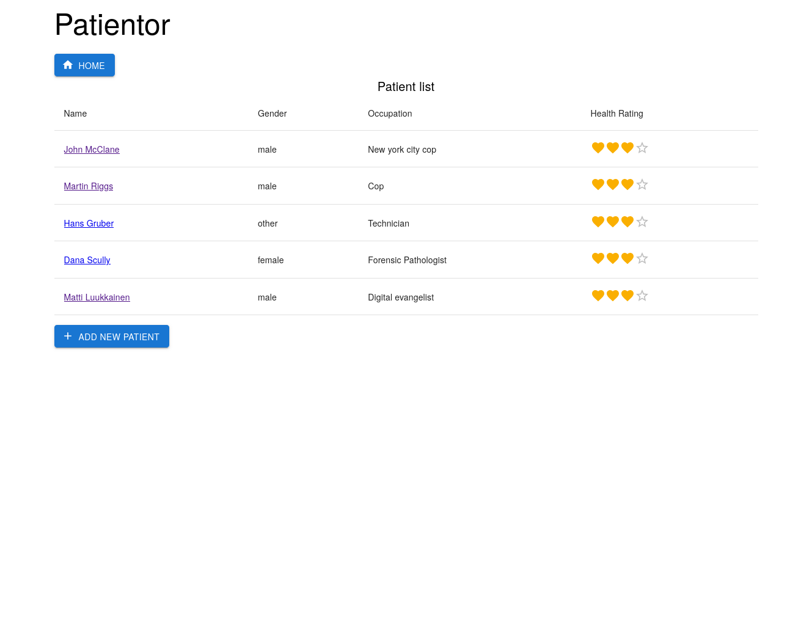
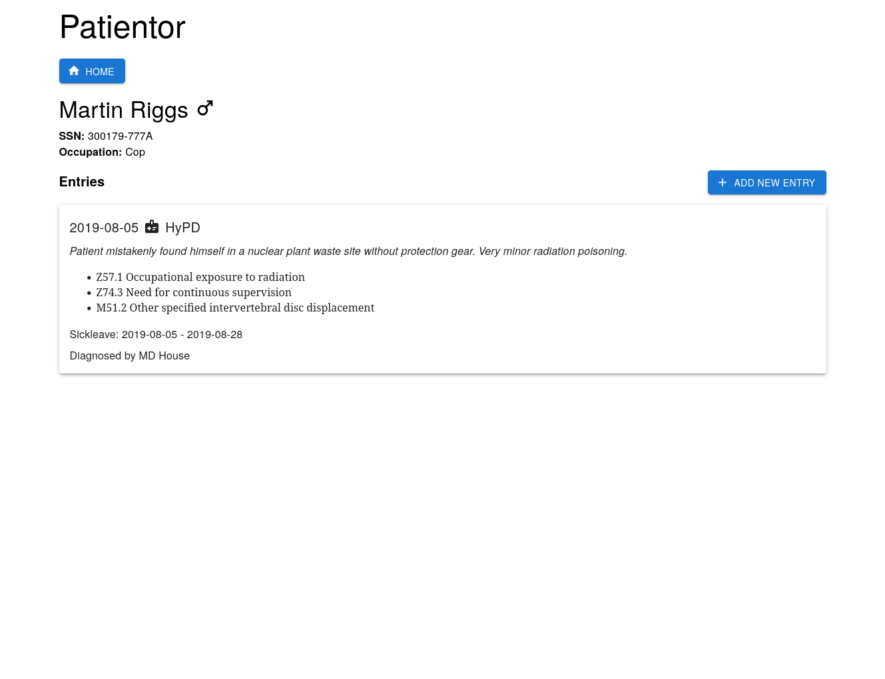
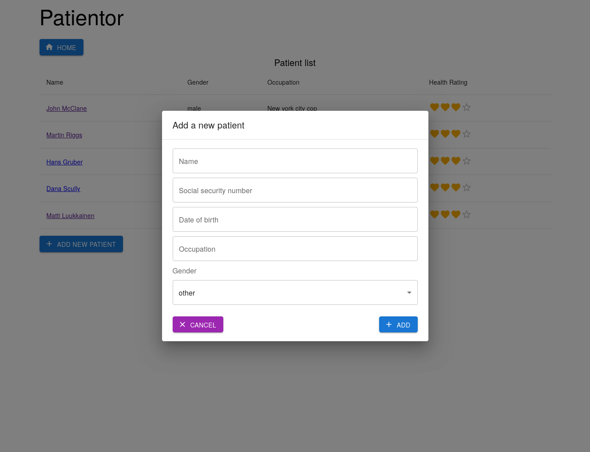
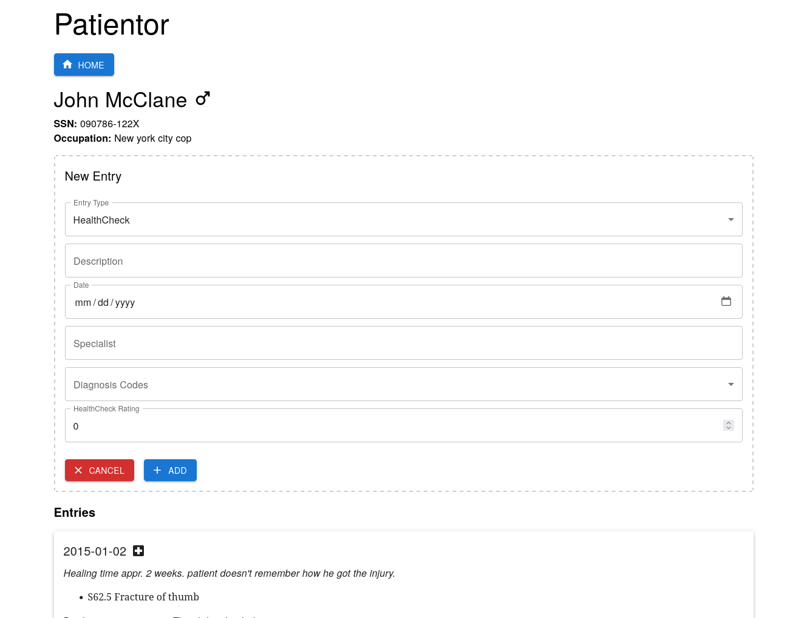

# Patientor Application
A TypeScript-based medical record system for managing patient directories and detailed medical histories, built as part of the *Full Stack Open* curriculum. This project demonstrates the power of end-to-end type safety and strictly validated full-stack architecture.

---

## Features
- View Patient Directory
- Detailed Medical Histories & Diagnoses
- Add New Patients
- Add Specialized Medical Entries (Hospital, Occupational Healthcare, Health Check)
- Strict Form & Payload Validation

## Tech Stack
- **Frontend:** React, TypeScript, Material-UI, Axios
- **Backend:** Node.js, Express.js, TypeScript
- **Validation:** Custom Type Guards, Zod

## Architecture & Design

* **End-to-End Type Safety:** Shared interfaces and types across both the client and server ensure a highly stable, predictable, and maintainable codebase.
* **Strict Payload Validation:** All incoming API requests are parsed and validated using comprehensive type guards before processing, preventing runtime errors and ensuring data integrity.
* **Separation of Concerns:** The backend is neatly divided into router and service layers, keeping the business logic modular and completely independent from the HTTP transport layer.
* **Clean UI Components:** Utilized Material-UI to build a consistent, accessible, and professional user interface with minimal custom CSS overhead.

## Screenshots

| Directory | Patient Details | Add Patient | Add Medical Entry |
| :---: | :---: | :---: | :---: |
|  |  |  |  |

## Installation & Setup

### 1. Backend Setup
1.  **Clone the repository and navigate to the backend:**
    ```bash
    git clone <your-repo-link>
    cd backend
    ```
2.  **Install dependencies:**
    ```bash
    npm install
    ```
3.  **Start the development server:**
    ```bash
    npm run dev
    ```
    *(The backend typically runs on `http://localhost:3001`)*

### 2. Frontend Setup
1.  **Navigate to the frontend directory:**
    ```bash
    cd ../frontend
    ```
2.  **Install dependencies:**
    ```bash
    npm install
    ```
3.  **Start the application:**
    ```bash
    npm run dev
    ```